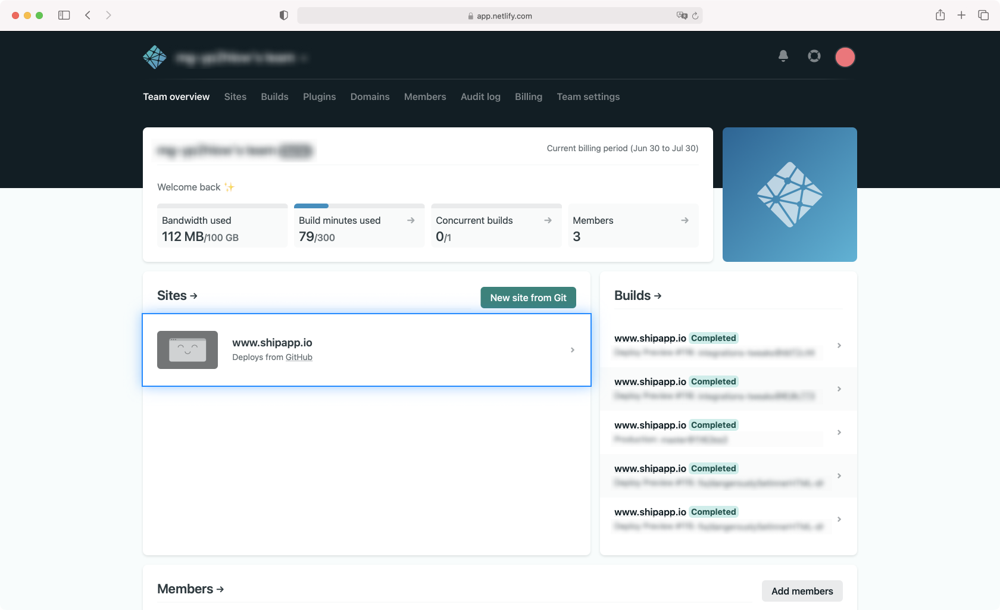
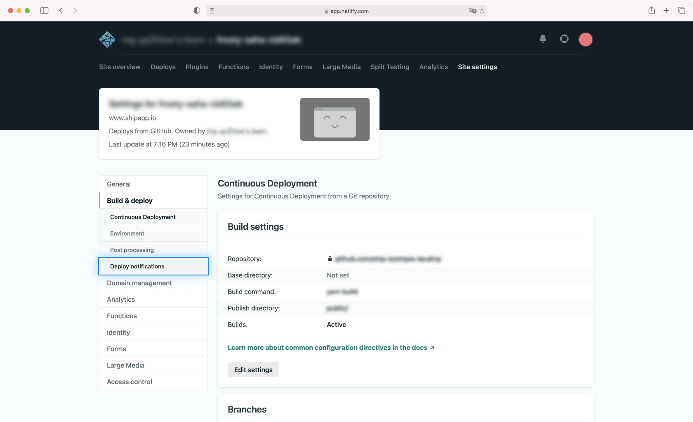
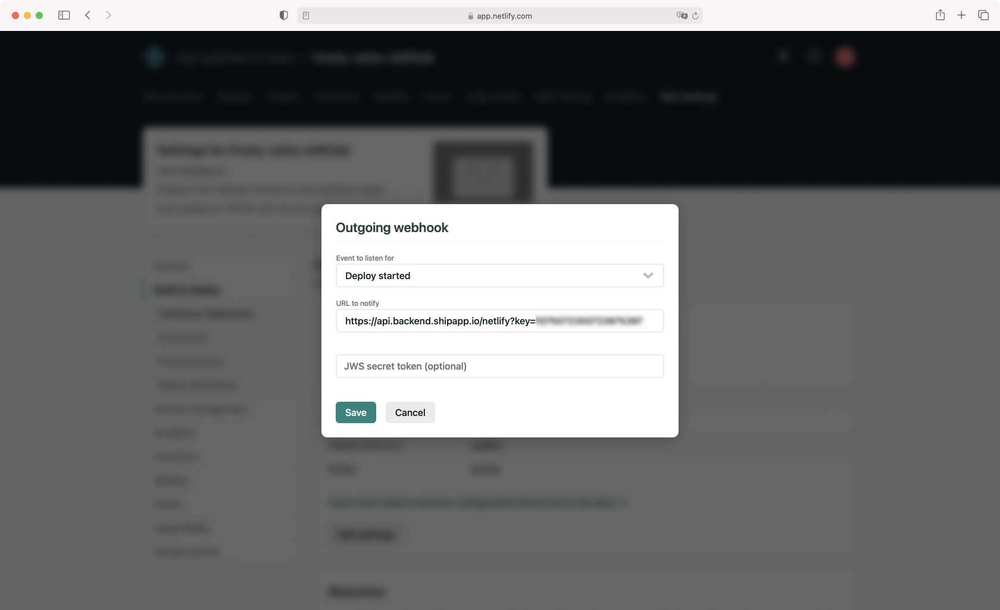

# CircleCI Orb for Ship

Welcome to Ship's [Netlify](https://www.netlify.com/) support! To learn how Ship can help you with your Netlify 
sites, please see [our website](https://www.shipapp.io/integrations/netlify).

To get Ship integrated, perform these steps:

## Step 1: Add the Ship App to your GitHub Organization

This can be done from our [GitHub Marketplace listing](https://github.com/marketplace/shipapp-io). Ship needs to 
integrate with Github for user authentication.

## Step 2: Get your Ship + Netlify Webhook URL + API Key

Email [hello@shipapp.io](mailto:hello@shipapp.io) to get yours!

## Step 3: Add your webhook URL to Netlify

Navigate to your Site:

Then go to Site Settings:

Next head to Deploy Notifications

And add Notifications for Outgoing Webhooks. Use the webhook URL we provide and create events for **all of** _Deploy 
Started_, 
_Deploy Succeeded_, and _Deploy Failed_. Leave the _JWS secret token_ field blank.

You should start seeing events in Ship the next time your site deploys!

## Support

If you need any help please drop us a line at [support@shipapp.io](mailto:support@shipapp.io) .

Happy Shipping!
